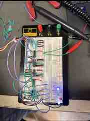

# 4-Bit Arithmetic Logic Unit

## Overview

Built a hardware **4-bit ALU** that performs addition, subtraction, increment, and decrement on signed binary values. The design combined multiplexers, XOR logic, and a 4-bit adder and required using **two's-complement arithmetic** for negative values.

## Architecture

Operation-select inputs **S1** and **S0** controlled the multiplexers and carry-in logic. The X operand was routed toward the adder while the Y path was manipulated by the multiplexers so the same adder hardware could implement several arithmetic operations.

Because of parts limitations, the lower X/Y bits were hard-coded to power or ground during testing while the most significant operand bits and operation-select lines were switch-controlled.

## Experimental Results

Example tests recorded in the report included:

| X | Y | Operation | Binary Result | Decimal Result | Cout |
| ---: | ---: | --- | --- | ---: | ---: |
| 2 | 5 | Addition | 0111 | 7 | 0 |
| 2 | 5 | Subtraction | 0011 | -3 | 0 |
| 2 | 5 | Increment | 1101 | 3 | 0 |
| 2 | 5 | Decrement | 0001 | 1 | 1 |
| 2 | -3 | Addition | 1111 | -1 | 0 |
| 2 | -3 | Subtraction | 0101 | 5 | 0 |

## Overflow Investigation

A particularly useful test used **X = -6** and **Y = -3**. Their mathematical sum is -9, but signed 4-bit two's-complement only represents values from **-8 to +7**. The observed 4-bit result therefore wrapped to 7, demonstrating the limitation of fixed-width arithmetic and the importance of overflow/carry information.

## Skills Demonstrated

Binary Arithmetic • Two's Complement • Multiplexers • 4-Bit Adders • XOR Logic • Overflow Analysis • Breadboarding • Hardware Debugging

**Context:** Collaborative Digital Logic Design laboratory project.
