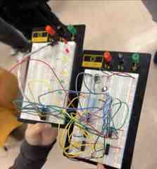

# Demand-Driven Traffic Signal Controller

## Overview

Designed and implemented a **synchronous finite-state-machine traffic controller** for a main road, cross road, and pedestrian request. Under normal operation, the main road remains green and the cross road remains red. A pedestrian **Walk** request initiates the timed traffic sequence.

## Required Sequence

The controller was designed around four states. After a pedestrian request, the main road transitions through amber to red while the cross road receives green, then amber, before the system returns to its default main-road-green state. Each timed state lasts approximately **4 seconds**.

## Clock Generator

A **555 timer in astable mode** generated a **0.25 Hz clock**, giving one state transition approximately every four seconds. The implemented timing network used approximately:

- R1 = 1 kΩ
- R2 = 28 kΩ
- C = 100 µF

This replaced the manual clock used in the earlier sequential-logic lab and allowed the traffic sequence to advance automatically.

## FSM Implementation

Two **74LS74 D flip-flops** stored state bits Q1 and Q0. From the state-transition analysis, the next-state logic included:

    D1 = Q1 XOR Q0
    D0 = Q0'[(Q1'P') + Q1]

The combinational logic was implemented with:

- 74LS86 XOR gates
- 74LS08 AND gates
- 74LS32 OR gates
- 74LS04 NOT gates

Traffic-light outputs were decoded from the state bits using additional logic including 74LS00 NAND gates.

## Debugging

During hardware testing, several LED outputs initially appeared to behave opposite to the expected state. The state-transition logic itself was correct; the issue was traced to **active-low output behavior**. Recognizing the distinction between active-high and active-low signals resolved the apparent inversion.

The project was built and tested in sections, using a logic probe and intermediate checks to separate timing, state-memory, transition-logic, and output-decoder problems.

## Skills Demonstrated

FSM Design • 555 Timer • Astable Clock Generation • D Flip-Flops • Boolean Excitation Equations • Active-Low Logic • 74LS ICs • Hardware Debugging • Digital System Integration

**Context:** Collaborative Digital Logic Design final laboratory project.
